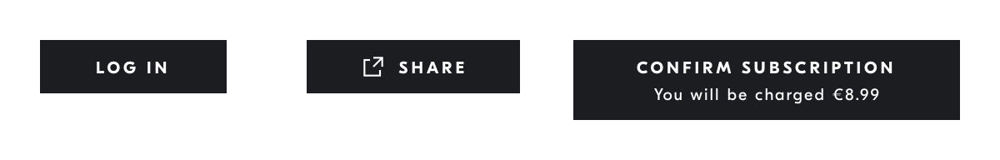
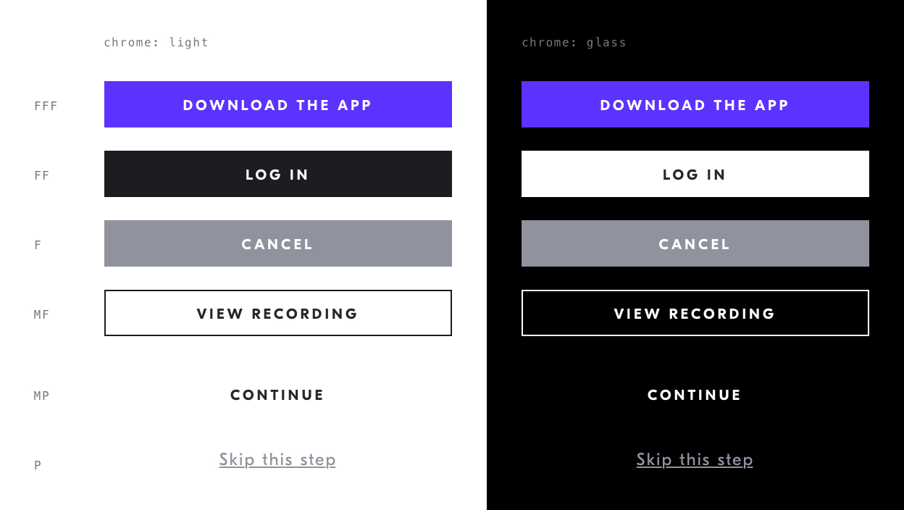
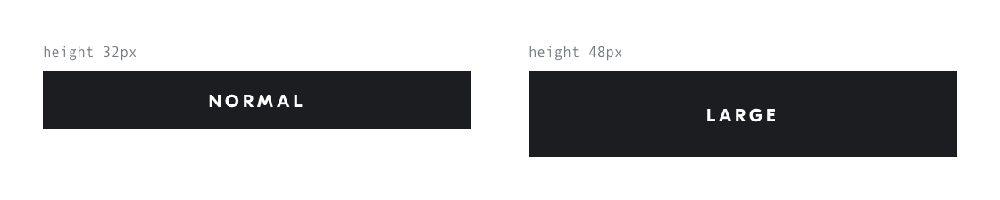
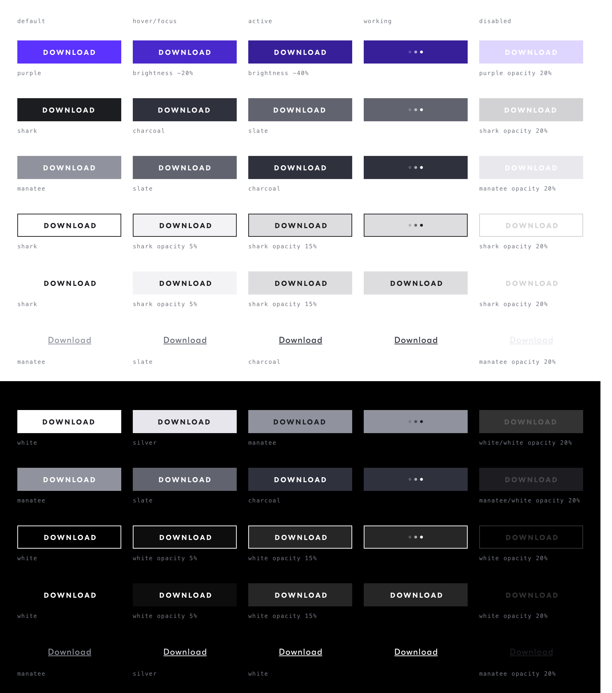
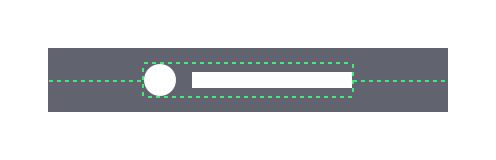
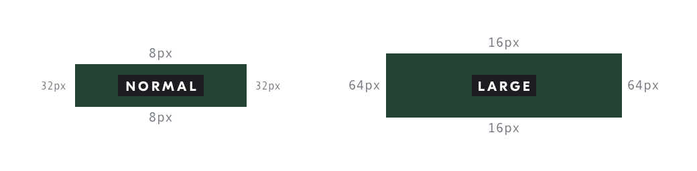
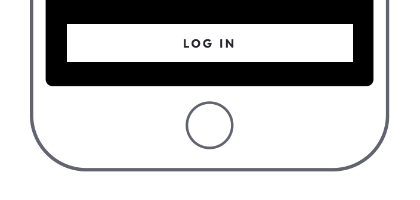

# Action Button


## Purpose *
Invoke an event, execute a presented action, progress to the next phase of an action.

## Content Structure *
```
<label> | <icon> <label> | <label> <additional-text>
```

## Variations
### Volume x Chrome
We use a [musical naming convention](https://ipfs.io/ipfs/QmXoypizjW3WknFiJnKLwHCnL72vedxjQkDDP1mXWo6uco/I/m/Dynamic's_Note_Velocity.svg.png) for the volume scale.



### Size


## States
### Interaction States
- Default
- Hover / Focus
- Active
- Loading
- Disabled



## Visual Specifications

### Text
`GT Eesti Display Bold` @ `10px`/`12px`/`2px`, `uppercase`

### Alignment
The label and icon should always be aligned centrally to the button box.



### Icon Spacing


The margin between the label and the icon's bounding box should be equal to one 'tiny' spacing unit (see [Spacing](https://github.com/IDAGIO/idagio-pattern-library/tree/master/perceptual/spacing)).

### Padding
The button’s left/right padding should be minimum 4x the top/bottom padding.



### Small Screens
Wide buttons should be extended to fill the width the available space on narrow screens.



<!-- ## Usage Specifications
_Where and how should this pattern be used in an interface?_ -->
