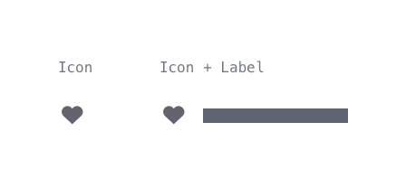
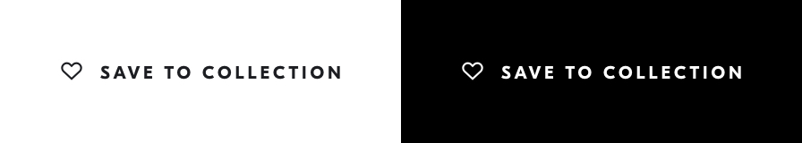
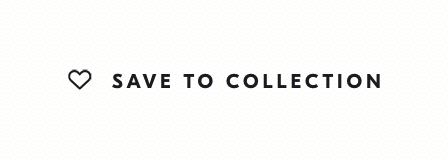
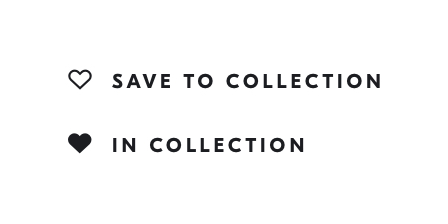
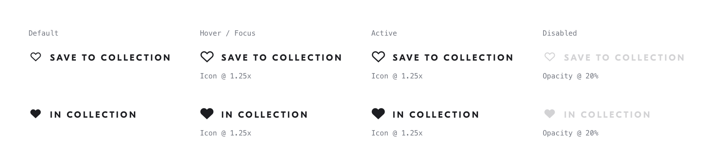

# Collection Button
## Purpose *
Add or remove the current content to your collection.

## Content Structure *
- Icon
- (Label)

## Variations
### Chrome
- Light
- Glass

## States

### In Collection
- False (icon: heart, label: “Save to collection”)
- True (icon: heart-block, label: “In Collection”)

### Interaction States
- Default
- Hover / Focus
- Active
- Disabled

## Visual Specifications
### TODO Transitions
*Specify transitions when they've been defined globally*

## Usage Specifications
*Where and how should this pattern be used in an interface?*
