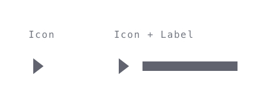
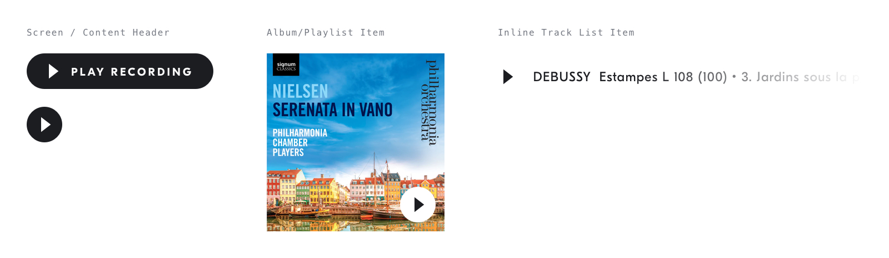

# Play Button
## Purpose *
Start playback of the current content item or list of content items.

## Content Structure *
- Icon [play|pause]
- (Label: “Play [content type]”)

## Variations
### Context
- Screen or content header
- Album/Playlist item
- Inline track list item

## States
### Is Playing #TODO
- False (icon: play)
- Loading (icon: loading)
- True (icon: pause)

### Interaction States #TODO
- Default
- Hover / Focus
- Active
- Disabled

## Visual Specifications
### TODO Transitions
*Specify transitions when they've been defined globally*

### Appearance
Buttons which invoke audio playback functionality have fully rounded corners, in order to differentiate them from other action buttons.

## Usage Specifications
### Position
Play buttons should be positioned inside or as close as possible to the content they act upon.
