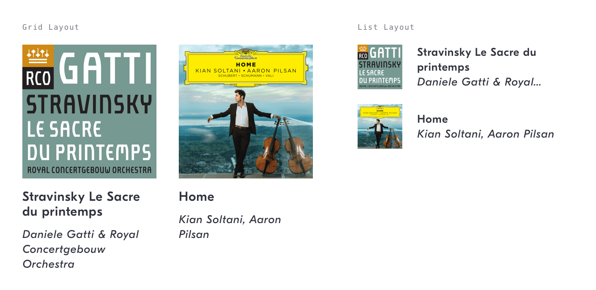
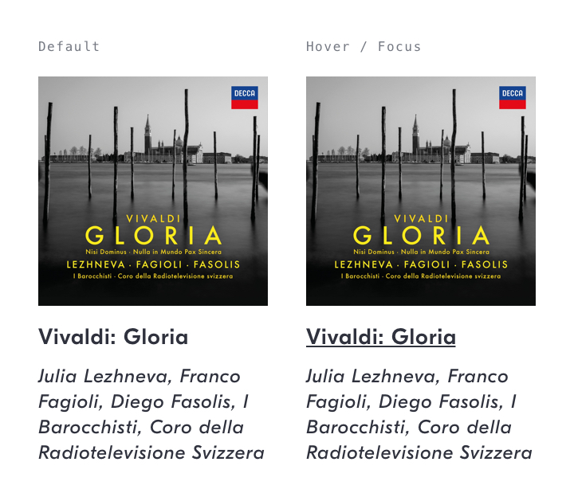
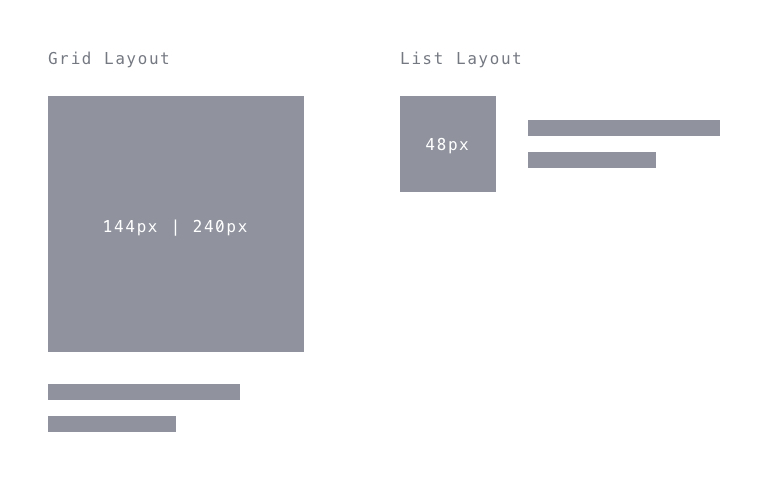
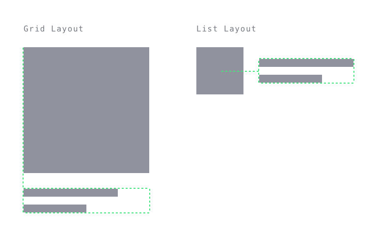

# Album Item Link
## Purpose *
See a summary of, and navigate to, an album.



## Content Structure *
```
<album-cover>
<play-button>?
<album-title>
<performer-summary>
```

## Variations
- Grid Layout
- List Layout

## States


- Default
- Hover / Focus: `<album-title>` underlined text

## Visual Specifications

### Size


##### Grid Layout
`<album-cover>` 144 x 144px | 240 x 240px

##### List Layout
`<album-cover>` 48px x 48px

### Alignment


##### Grid Layout
In a grid layout, text should be aligned to the left in relation to the album cover.

##### List Layout
In a list layout, text should be aligned centrally in relation to the album cover.

### Content Length
##### Grid Layout
`<album-title>` Render in full.  
`<performer-summary>` Render in full.

##### List Layout
`<album-title>` 2 lines maximum, cropped.  
`<performer-summary>` 1 line maximum, cropped.

### Text
##### Grid Layout
`<album-title>` `GT Eesti Display Regular` @ `14px`/`16px`/`.5px`, `shark`  
`<performer-summary>` `GT Eesti Display Regular Italic` @ `12px`/`16px`/`.5px`, `shark`

##### List Layout
`<album-title>` `GT Eesti Display Regular` @ `12px`/`16px`/`.5px`, `shark`  
`<performer-summary>` `GT Eesti Display Regular Italic` @ `12px`/`16px`/`.5px`, `shark`

## Usage Specifications
Play button behaviour [TODO #5](https://github.com/IDAGIO/idagio-pattern-library/issues/5)
