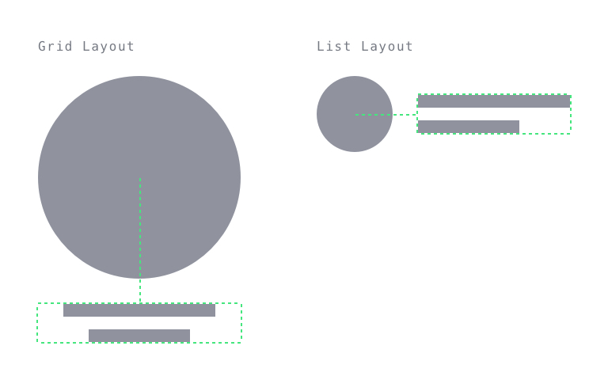

# Artist Item Link
## Purpose *
See a summary of, and navigate to, an artist’s profile.


## Content Structure *
```
<artist-avatar>
<artist-name>
<artist-role>?
```

## Variations
- Grid Layout
- List Layout

## States


- Default
- Hover / Focus: underlined text

## Visual Specifications
Artist items have circular avatars in order to differentiate them from content items which have square covers.

### Size


##### Grid Layout
`<artist-avatar>` 128px x 128px

##### List Layout
`<artist-avatar>` 48px x 48px

### Alignment
Text should be aligned centrally in relation to the avatar.



### Content Length
  

##### Grid Layout
`<artist-name>` Full length (no crop)  
`<artist-role>` Full length (no crop)
##### List Layout
`<artist-name>` 2 lines maximum, cropped  
`<artist-role>` 1 line maximum, cropped

### Text
`<artist-name>` `GT Eesti Display Regular` @ `14px`/`16px`/`.5px`, `shark`  
`<artist-role>` `GT Eesti Display Regular Italic` @ `12px`/`16px`/`.5px`, `slate`

<!--
## Usage Specifications
*Where and how should this pattern be used in an interface?*
-->
