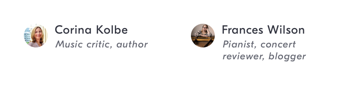
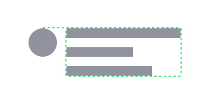

# Curator Card
## Purpose *
See a summary of a playlist’s curator.



## Content Structure *
```
<curator-avatar>
<curator-name>
<curator-role>
```

<!-- ## Variations
*What different types of this pattern exist? Does it change depending on the context?* -->

<!-- ## States
*How does the pattern change as the user interacts with it?* -->

## Visual Specifications
*What specific visual attributes should this pattern have?*

### Size
`<curator-avatar>` 24px x 24px

### Alignment


Text should be horizontally left-aligned, and vertically aligned to the top of the avatar.

### Text
`<curator-name>` `GT Eesti Display Regular` @ `12px`/`16px`/`.5px`, `shark`  
`<curator-role>` `GT Eesti Display Regular Italic` @ `10px`/`12px`/`.5px`, `slate`

<!-- ## Usage Specifications
*Where and how should this pattern be used in an interface?* -->
