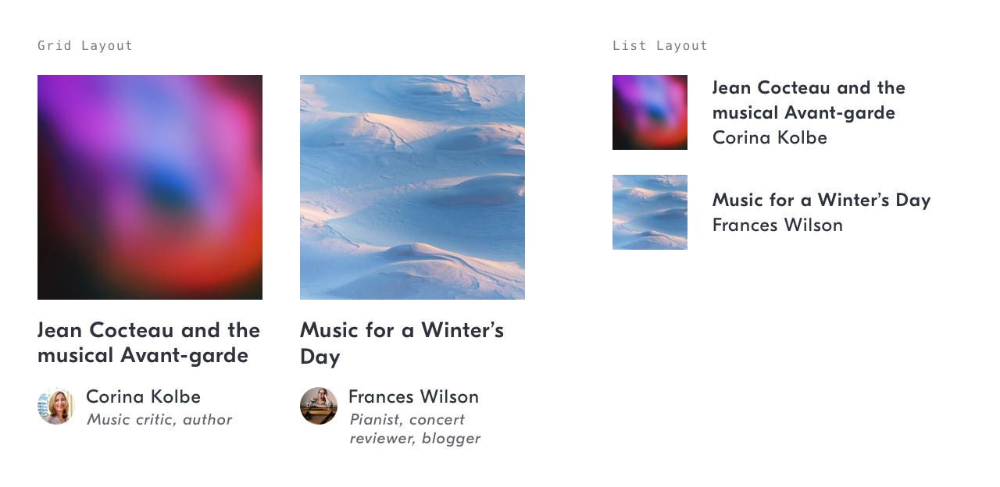
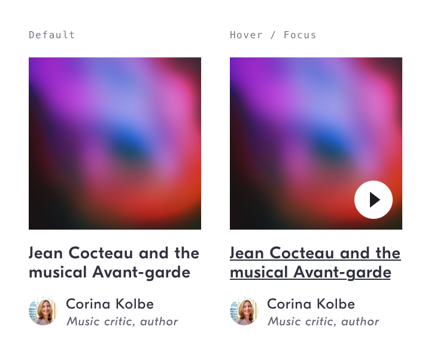
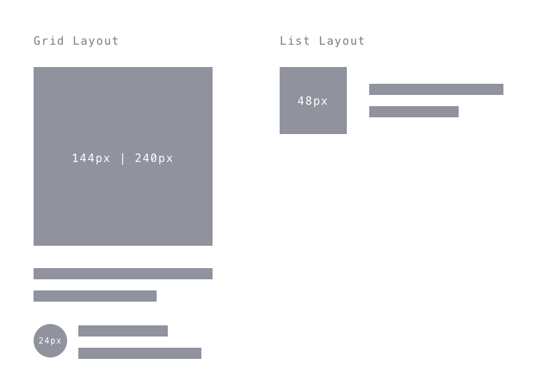
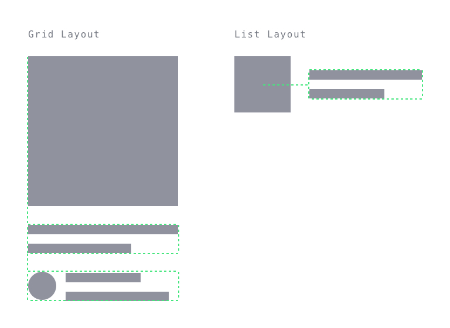

# Album/Playlist Item Link
## Purpose *
See a summary of, and navigate to, a playlist.



## Content Structure *
```
<playlist-cover>
<play-button>?
<playlist-title>
[<curator-name> | <curator-card>]
```

## Variations
- Grid Layout
- List Layout

## States
  

- Default
- Hover / Focus: `<playlist-title>` underlined text

## Visual Specifications
### Size


##### Grid Layout
`<playlist-cover>` 144 x 144px | 240 x 240px  
`<curator-card>` see [content-item-links/curator-card](../curator-card).

##### List Layout
`<playlist-cover>` 48px x 48px

### Alignment


##### Grid Layout
In a grid layout, text should be aligned to the left in relation to the playlist cover.

##### List Layout
In a list layout, text should be aligned centrally in relation to the playlist cover.

### Content Length
##### Grid Layout
`<playlist-title>` Render in full.  
`<curator-card>` see [content-item-links/curator-card](../curator-card).

##### List Layout
`<playlist-title>` 2 lines maximum, cropped.  
`<curator-name>` 1 line maximum, cropped.  

### Text
##### Grid Layout
`<playlist-title>` `GT Eesti Display Medium` @ `14px`/`16px`/`.5px`, `shark`  
`<curator-card>` see [content-item-links/curator-card](../curator-card).

##### List Layout
`<playlist-title>` `GT Eesti Display Medium` @ `12px`/`16px`/`.5px`, `shark`  
`<curator-name>` `GT Eesti Display Regular` @ `12px`/`16px`/`.5px`, `shark`

## Usage Specifications
Play button behaviour [TODO #5](https://github.com/IDAGIO/idagio-pattern-library/issues/5)
