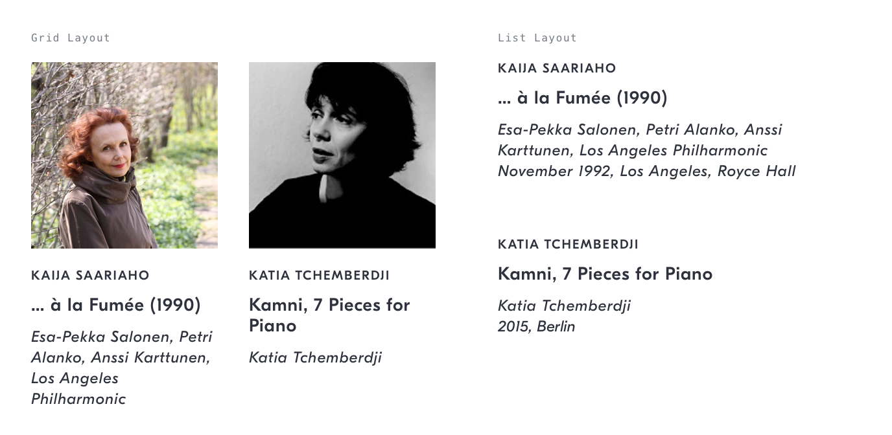

# Recording Item Link
## Purpose *
See a summary of, and navigate to, a recording.



## Content Structure *
```
`<recording-cover>?`
`<play-button>?`
`<work-composer>?`
`<work-title>?`
`<recording-info>`
`<collection-button>`?
```

## Variations
- Grid layout
- List Layout

<!-- ## States
*How does the pattern change as the user interacts with it?* -->

## Visual Specifications

### Text
`<work-composer>` see [work-composers](../../content-labels/work-composers)   
`<work-title>` `GT Eesti Display Medium` @ `14px`/`16px`/`.5px`, `shark`  
`<recording-info>` `GT Eesti Display Regular Italic` @ `12px` / `16px` / `.5px`, `shark` (see [recording-info](../../content-labels/recording-info#visual-specifications))  

<!-- ## Usage Specifications
*Where and how should this pattern be used in an interface?* -->
