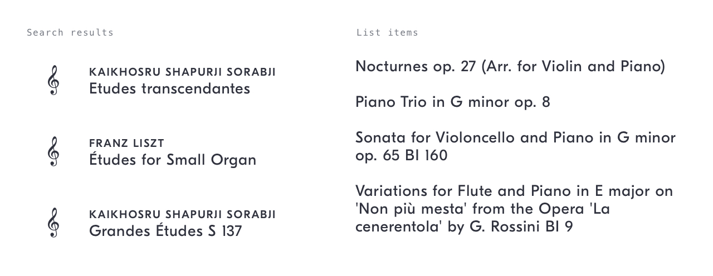
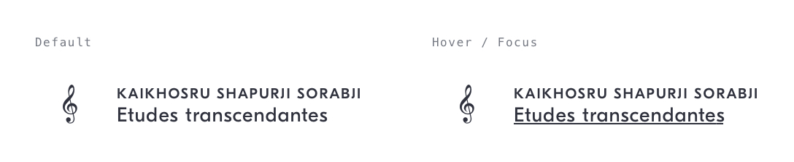

# Work Item Link
## Purpose *
See a summary of, and navigate to, a work – typically within a list.



## Content Structure *
```
<icon-work>?
<work-composers>?
<work-title>
```

## Variations
As a search result, the icon is included to maintain visual consistency with, and differentiation from, other content types.

## States
- Default
- Hover / Focus: `<work-title>` underlined text



## Visual Specifications

### Text
`<work-composers>` see [content-labels/curator-card](../content-labels/work-composers)  
`<work-title>` `GT Eesti Display Regular` @ `14px`/`16px`/`.5px`, `shark`

<!-- ## Usage Specifications
*Where and how should this pattern be used in an interface?* -->
