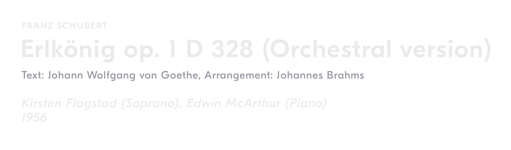
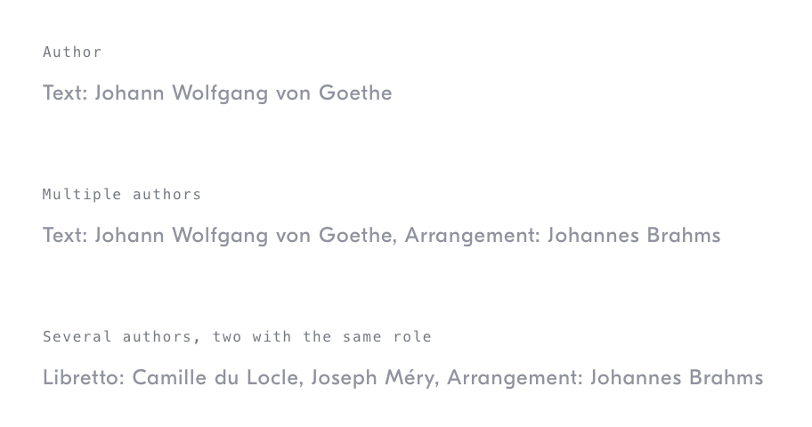

# Work Authors Label
## Purpose *
See the secondary authors for a particular work – typically alongside the composer(s) and title of a work.

Authors differ from composers, and they are represented on a subsidiary level. An analogy can be drawn with architecture: a building is attributed to an architect but many other people — such as engineers and designers — make important contributions.

## Content Structure *
`<author-role>: <author-name>[, <author-name>]* [, <author-role>: <author-name>]*`

- Authors are listed in terms of their role.  
- There can be multiple authors, each with different roles.  
- There can be multiple authors with the same role.  

<!-- ## Variations
*What different types of this pattern exist? Does it change depending on the context?* -->

<!-- ## States
*How does the pattern change as the user interacts with it?* -->

## Visual Specifications

### Text
`GT Eesti Display Regular` @ `12px`/`16px`/`.5px`, `manatee`

<!-- ## Usage Specifications
*Where and how should this pattern be used in an interface?* -->
