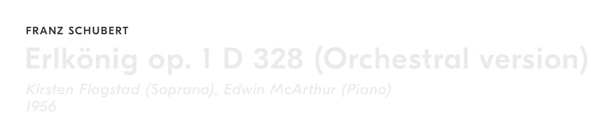
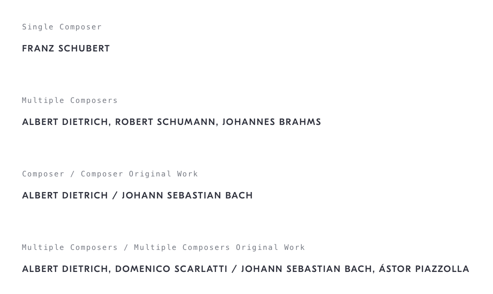

# Work Composer Label
## Purpose *
See the name of a composer, or multiple composers, of a particular work.

## Content Structure *
`<composer-name> [, <composer-name>]* [ / <original-composer-name> [, <original-composer-name>]* ]?`

- A work can have multiple composers (co-composers) in a comma separated list.
- In the case of an adaptation, the composer(s) of the original work should be separated by a `/`.

<!-- ## Variations
*What different types of this pattern exist? Does it change depending on the context?* -->

<!--
## States
*How does the pattern change as the user interacts with it?*
-->

## Visual Specifications

### Text
`GT Eesti Display Medium` @ `10px`/`12px`/`1px`, `uppercase`, `shark`

The labels can also function as a link to the composer's profile, in which case it should use the standard text link style.

<!--
## Usage Specifications
*Where and how should this pattern be used in an interface?*
-->
