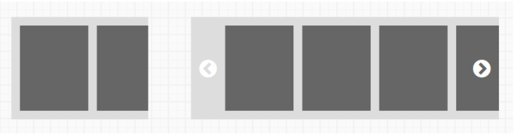

# "Flick Through"
## Purpose *
Browse a list of content by scrolling horizontally.

## Content Structure *
- [Artist Item Links](../../content-item-links/artist/), Facet Item Links, [Album Item Links](../../content-item-links/album/) or [Playlist Item Links](../../content-item-links/playlist/)

## Variations
### Viewport
- Narrow (mobile)
- Wide (desktop)

### Device
- Touchscreen (mobile)
- Pointer (desktop)

## States
*How does the pattern change as the user interacts with it?*

## Visual Specifications
*What specific visual attributes should this pattern have?*

## Usage Specifications
*Where and how should this pattern be used in an interface?*
