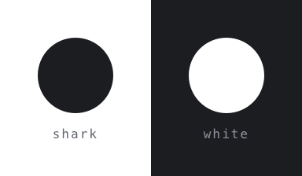
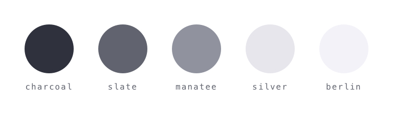
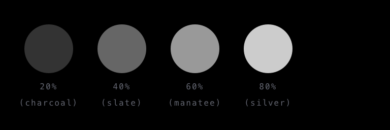
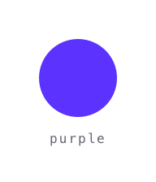
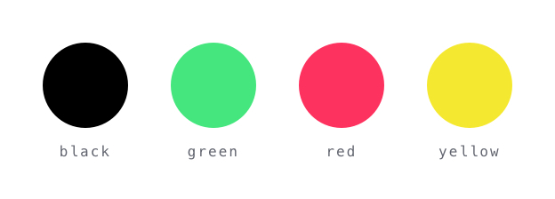

# Colour

## Foundation


Use foundation colours wherever possible.
```
shark     #1c1d21   hsl(227, 17%, 13%)
white     #ffffff   hsl(0, 0%, 100%)
```
## Auxiliary


Use auxiliary colours only when necessary.
```
charcoal  #2f323d   hsl(227, 13%, 21%)
slate     #61646e   hsl(226, 6%, 41%)
manatee   #90939e   hsl(227, 7%, 59%)
silver    #e6e6eb   hsl(240, 11%, 91%)
berlin    #f2f2f7   hsl(240, 24%, 96%)
```

#### "Glass" Chrome
When using a ["glass" interface type](../../_glossary#glass-chrome), auxiliary colours should be achieved with opacity.



```
charcoal  #ffffff @ 20%   hsla(0, 0%, 100%, .2)
slate     #ffffff @ 40%   hsla(0, 0%, 100%, .4)
manatee   #ffffff @ 60%   hsla(0, 0%, 100%, .6)
silver    #ffffff @ 80%   hsla(0, 0%, 100%, .8)
berlin    
```
*There is no equivalent to 'berlin' as there is negligible difference in contrast between 'berlin' and 'white' in this context.*

## Highlight


Purple should only be used for crucial notifications or decisive calls-to-action, at a maximum of one per screen/context, and only be used when black or white can not provide enough volume.
```
purple    #5b32fe   hsl(252, 80%, 100%)
```
## Utility


Utility colours reflect a state or provide a visual functionality in a user interface.
```
black     #000000   hsl(0, 0%, 0%)
green     #45e67d   hsl(141, 70%, 90%)
red       #fe325e   hsl(347, 80%, 100%)
yellow    #f5e831   hsl(56, 80%, 96%)
```
